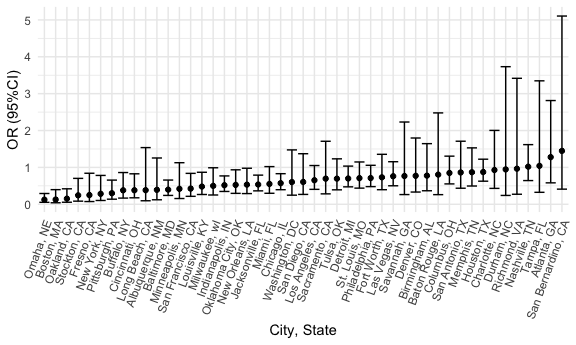
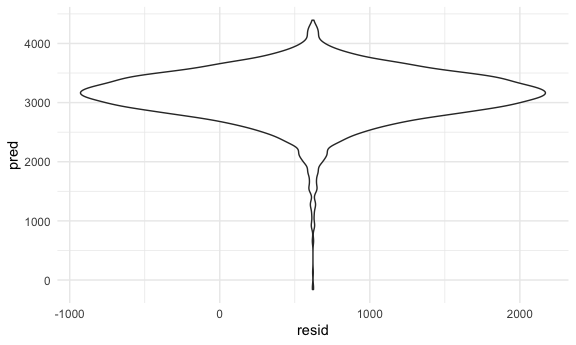
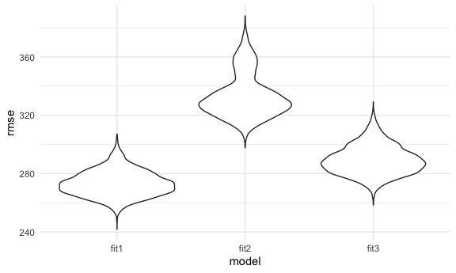
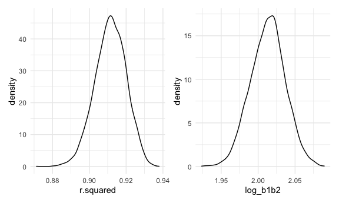

Homework 6
================
Thiago de Araujo - UNI tbd2117

### Problem 1

Loading homicide data, creating `city_state` variable, binary
`homicide_solve`, omiting specific cities, limiting analysis for whom
`victim_race` is `white` or `black`, and `victim_age` numeric.

``` r
homicide = 
  read_csv("./data/homicide-data.csv", na = c("", "NA", "Unknown")) %>% 
  mutate(city_state = str_c(city, ", ", state)) %>% 
  filter(
    !city_state == c("Tulsa, AL", "Dallas, TX", "Phoenix, AZ", "Kansas City, MO"),
    victim_race == c("White", "Black")
  ) %>% 
  mutate(
    victim_age = as.numeric(victim_age),
    homicide_solved = case_when(
                        disposition %in% c("Open/No arrest", "Closed without arrest") ~ 0,
                        disposition == "Closed by arrest" ~ 1
                      )
  ) %>% 
  select(city_state, homicide_solved, victim_age, victim_sex, victim_race)
```

Estimated adjusted **odds ratio** for solving homicides comparing
non-white victims to white victims keeping all other variables fixed.

``` r
homicide %>% 
  filter(city_state == "Baltimore, MD") %>%
  mutate(
    victim_race = fct_relevel(victim_race, "White")
  ) %>% 
  glm(
    homicide_solved ~ victim_age + victim_sex + victim_race, 
    family = binomial(link = "logit"),
    data = .) %>% 
  broom::tidy() %>%
  filter(term == "victim_raceBlack") %>% 
  mutate(
    OR = exp(estimate),
    UCL = exp(estimate + (1.96*std.error)),
    LCL = exp(estimate - (1.96*std.error)),
    term = str_replace(term, "victim_raceBlack", "Non-white vs. white victims ")
  ) %>% 
  select(term, OR, LCL, UCL) %>% 
  knitr::kable(digits = 2)
```

| term                        |  OR |  LCL |  UCL |
| :-------------------------- | --: | ---: | ---: |
| Non-white vs. white victims | 0.4 | 0.24 | 0.66 |

Adjusted odds ratio (and CI) for solving homicides comparing Black
victims to white victims by city.

``` r
homicide_results = 
  homicide %>% 
  mutate(
    victim_race = fct_relevel(victim_race, "White")
  ) %>% 
  nest(data = -city_state) %>%
  mutate(
    models = map(.x = data, ~glm(
                              homicide_solved ~ victim_age + victim_sex + victim_race, 
                              family = binomial(link = "logit"),
                              data = .x)
             ),
    results = map(models, broom::tidy)
  ) %>% 
  select(-data, -models) %>% 
  unnest(results) %>% 
  mutate(
    OR = exp(estimate),
    UCL = exp(estimate + (1.96*std.error)),
    LCL = exp(estimate - (1.96*std.error)),
    term = str_replace(term, "victim_raceBlack", "Non-white vs. white victims")
  ) %>% 
  select(city_state, term, OR, LCL, UCL)

homicide_results %>%
  filter(term == "Non-white vs. white victims") %>% 
  mutate(city_state = fct_reorder(city_state, OR)) %>% 
  ggplot(aes(x = city_state, y = OR)) + 
  geom_point() +
  geom_errorbar(aes(ymin = LCL, ymax = UCL)) +
  theme(axis.text.x = element_text(angle = 70, vjust = 1, hjust = 1)) + 
  xlab("City, State") +
  ylab("OR (95%CI)")
```



In most cities black victims have a lower likelihood than white victims
to have solved homicides adjusting for age and sex. Omaha, NE has the
lowest likelihood of the cities analyzed. On the other hand, in San
Bernardino, CA, a black victim has almost 50% more odds to have a solved
homicide when compared to a white victim.

### Problem 2

Loading data and cleaning

``` r
birthweight_df = 
  read_csv("./data/birthweight.csv") 
```

    ## Parsed with column specification:
    ## cols(
    ##   .default = col_double()
    ## )

    ## See spec(...) for full column specifications.

``` r
baby_df =
  birthweight_df %>% 
  mutate(
    babysex = case_when(babysex == 1 ~ "male",
                        babysex == 2 ~ "female"),
    frace = as.factor(frace),
    mrace = as.factor(mrace)
  )

# skimr::skim(birthweight_df)
```

Looking at colinearity among variables…

``` r
correlate(birthweight_df) %>%
select_if(~any(. > 0.7))
```

    ## Warning in stats::cor(x = x, y = y, use = use, method = method): the standard
    ## deviation is zero

    ## 
    ## Correlation method: 'pearson'
    ## Missing treated using: 'pairwise.complete.obs'

    ## # A tibble: 20 x 9
    ##    term     bhead  blength      bwt    delwt    frace    mrace    ppbmi     ppwt
    ##    <chr>    <dbl>    <dbl>    <dbl>    <dbl>    <dbl>    <dbl>    <dbl>    <dbl>
    ##  1 baby… -0.169   -0.105   -0.0866  -0.0164   0.0309   0.0360  -6.99e-3 -0.00101
    ##  2 bhead NA        0.630    0.747    0.214   -0.0961  -0.110    8.66e-2  0.137  
    ##  3 blen…  0.630   NA        0.743    0.229   -0.113   -0.132    7.40e-2  0.149  
    ##  4 bwt    0.747    0.743   NA        0.288   -0.179   -0.208    9.39e-2  0.183  
    ##  5 delwt  0.214    0.229    0.288   NA       -0.0648  -0.0922   7.21e-1  0.871  
    ##  6 finc…  0.116    0.0787   0.155    0.0350  -0.285   -0.305   -2.02e-2  0.0473 
    ##  7 frace -0.0961  -0.113   -0.179   -0.0648  NA        0.829    4.59e-2 -0.0596 
    ##  8 gawe…  0.378    0.359    0.412    0.124   -0.114   -0.132    2.73e-2  0.0565 
    ##  9 malf…  0.00300 -0.00902  0.00133  0.0121  -0.0269  -0.0277   2.55e-4 -0.00338
    ## 10 mena… -0.00302 -0.0211  -0.0244  -0.0859   0.0212   0.0134  -1.22e-1 -0.0705 
    ## 11 mhei…  0.117    0.160    0.192    0.411   -0.201   -0.230   -1.01e-1  0.427  
    ## 12 moma…  0.108    0.0802   0.136    0.0740  -0.187   -0.212    8.12e-2  0.130  
    ## 13 mrace -0.110   -0.132   -0.208   -0.0922   0.829   NA        3.48e-2 -0.0842 
    ## 14 pari… -0.0200  -0.0325  -0.00837 -0.00471  0.00118  0.00212 -5.93e-3 -0.0112 
    ## 15 pnum… NA       NA       NA       NA       NA       NA       NA       NA      
    ## 16 pnum… NA       NA       NA       NA       NA       NA       NA       NA      
    ## 17 ppbmi  0.0866   0.0740   0.0939   0.721    0.0459   0.0348  NA        0.853  
    ## 18 ppwt   0.137    0.149    0.183    0.871   -0.0596  -0.0842   8.53e-1 NA      
    ## 19 smok… -0.0539  -0.0656  -0.0756   0.0486  -0.173   -0.198    7.02e-3  0.0389 
    ## 20 wtga…  0.183    0.191    0.247    0.425   -0.0218  -0.0320  -1.10e-1 -0.0749

Removing `ppwt` because of its colinearity with `delwt` and `ppbmi`.
Also, bmi at delivery saves a df (created `bmi_del` from `delwt` and
`mheight`).

Now checking non-significant predictors…

``` r
baby_df %>% 
  mutate(
    del_bmi = (delwt / (mheight)^2)*703
  ) %>% 
  select(-ppwt, -delwt, -mheight) %>% 
  lm(bwt ~ ., data = .) %>% 
  broom::tidy() %>% 
  filter(p.value > 0.05)
```

    ## # A tibble: 10 x 5
    ##    term     estimate std.error statistic p.value
    ##    <chr>       <dbl>     <dbl>     <dbl>   <dbl>
    ##  1 fincome     0.299     0.179    1.67    0.0957
    ##  2 frace2     13.0      46.1      0.281   0.778 
    ##  3 frace3     17.2      69.2      0.248   0.804 
    ##  4 frace4    -53.2      44.6     -1.19    0.234 
    ##  5 frace8      3.59     74.0      0.0486  0.961 
    ##  6 malform    12.2      70.6      0.173   0.863 
    ##  7 menarche   -3.38      2.89    -1.17    0.242 
    ##  8 momage      0.809     1.22     0.663   0.508 
    ##  9 mrace3    -88.3      71.8     -1.23    0.219 
    ## 10 mrace4    -53.4      45.1     -1.18    0.236

Looking at race frequencies…

``` r
baby_df %>% 
  group_by(frace) %>% 
  count()
```

    ## # A tibble: 5 x 2
    ## # Groups:   frace [5]
    ##   frace     n
    ##   <fct> <int>
    ## 1 1      2123
    ## 2 2      1911
    ## 3 3        46
    ## 4 4       248
    ## 5 8        14

``` r
baby_df %>% 
  group_by(mrace) %>% 
  count()
```

    ## # A tibble: 4 x 2
    ## # Groups:   mrace [4]
    ##   mrace     n
    ##   <fct> <int>
    ## 1 1      2147
    ## 2 2      1909
    ## 3 3        43
    ## 4 4       243

Opted to remove frace and colapse mother races with less frequency (1=
white, 2 = black, 3 = other).

Then, looking at the model without `fincome`, `malform`, `menarche`,
`momage`, and `parity` (and `pnumlbw` and `pnumsga` due to low
frequency)…

``` r
baby_df %>% 
  mutate(
    del_bmi = (delwt / (mheight)^2)*703,
    mrace_3 = case_when(mrace == 1 ~ "White",
                      mrace == 2 ~ "Black",
                      mrace != 1|2 ~ "Other")
  ) %>% 
  select(-frace, -mrace, -ppwt, -delwt, -mheight, -fincome, -malform, -menarche, -momage, -parity, -pnumlbw, -pnumsga) %>% 
  lm(bwt ~ ., data = .) %>% 
  broom::tidy()
```

    ## # A tibble: 11 x 5
    ##    term         estimate std.error statistic   p.value
    ##    <chr>           <dbl>     <dbl>     <dbl>     <dbl>
    ##  1 (Intercept)  -5788.      97.4      -59.4  0.       
    ##  2 babysexmale    -29.4      8.44      -3.48 5.06e-  4
    ##  3 bhead          131.       3.44      38.1  1.14e-274
    ##  4 blength         74.9      2.01      37.2  7.25e-263
    ##  5 gaweeks         11.5      1.46       7.91 3.24e- 15
    ##  6 ppbmi          104.      12.1        8.56 1.50e- 17
    ##  7 smoken          -4.84     0.585     -8.27 1.78e- 16
    ##  8 wtgain          20.8      2.12       9.83 1.44e- 22
    ##  9 del_bmi        -96.0     11.9       -8.04 1.18e- 15
    ## 10 mrace_3Other    42.0     17.7        2.38 1.75e-  2
    ## 11 mrace_3White   147.       9.22      15.9  2.55e- 55

Saving my model df…

``` r
baby_df = 
  baby_df %>% 
  mutate(
    del_bmi = (delwt / (mheight)^2)*703,
    mrace_3 = case_when(mrace == 1 ~ "White",
                      mrace == 2 ~ "Black",
                      mrace != 1|2 ~ "Other")
  )

fit1 =
  baby_df %>% 
  lm(bwt ~ babysex + bhead + blength + gaweeks + ppbmi + smoken + wtgain + del_bmi + mrace_3, data = .)
```

Plot of residuals against fitted values…

``` r
baby_df %>% 
  modelr::add_residuals(fit1) %>%
  modelr::add_predictions(fit1) %>%
  ggplot(aes(x = resid, y = pred)) +
  geom_violin()
```



Creating comparison models…

``` r
fit2 =
  baby_df %>% 
  lm(bwt ~ blength + gaweeks, data = .)

fit3 = 
  baby_df %>% 
  lm(bwt ~ bhead*blength*babysex, data = .)
```

Cross validation…

``` r
cv_df =
  crossv_mc(baby_df, nrow(baby_df)) %>% 
  mutate(
    train = map(train, as_tibble),
    test = map(test, as_tibble)
  )
```

Getting RMSEs for the three models…

``` r
cv_df =
  cv_df %>% 
  mutate(
    fit1 = map(.x = train, ~lm(bwt ~ babysex + bhead + blength + gaweeks + ppbmi + smoken + wtgain + del_bmi +                                mrace_3, data = .x)),
    fit2 = map(.x = train, ~lm(bwt ~ blength + gaweeks, data = .x)),
    fit3 = map(.x = train, ~lm(bwt ~ bhead*blength*babysex, data = .x)),
    rmse_fit1 = map2_dbl(.x = fit1, .y = test, ~rmse(model = .x, data = .y)),
    rmse_fit2 = map2_dbl(.x = fit2, .y = test, ~rmse(model = .x, data = .y)),
    rmse_fit3 = map2_dbl(.x = fit3, .y = test, ~rmse(model = .x, data = .y))
  )
```

Generating plot to compare RMSEs:

``` r
cv_df %>% 
  select(starts_with("rmse")) %>% 
  pivot_longer(
    everything(),
    names_to = "model",
    values_to = "rmse",
    names_prefix = "rmse_"
  ) %>% 
  ggplot(aes(x = model, y = rmse)) +
  geom_violin()
```



The model *fit1* has the smallest prediction error based on MRSEs and
seems to be the best fit for predicting birthweigth amongst the three
models.

### Problem 3

Weather df…

``` r
weather_df = 
  rnoaa::meteo_pull_monitors(
    c("USW00094728"),
    var = c("PRCP", "TMIN", "TMAX"), 
    date_min = "2017-01-01",
    date_max = "2017-12-31")
```

    ## Registered S3 method overwritten by 'hoardr':
    ##   method           from
    ##   print.cache_info httr

    ## using cached file: /Users/thiagoaraujo/Library/Caches/R/noaa_ghcnd/USW00094728.dly

    ## date created (size, mb): 2020-10-02 07:31:47 (7.52)

    ## file min/max dates: 1869-01-01 / 2020-09-30

``` r
weather_df = 
  weather_df %>%  
  mutate(
    name = recode(id, USW00094728 = "CentralPark_NY"),
    tmin = tmin / 10,
    tmax = tmax / 10) %>%
  select(name, id, everything())
```

Pulling r^2 and log(beta\_zero\*beta\_one) from the specific model…

``` r
lm(tmax ~ tmin, data = weather_df) %>% 
  broom::glance() %>% 
  select(r.squared)
```

    ## # A tibble: 1 x 1
    ##   r.squared
    ##       <dbl>
    ## 1     0.912

``` r
lm(tmax ~ tmin, data = weather_df) %>% 
  broom::tidy() %>% 
  select(term, estimate) %>%
  pivot_wider(
    names_from = term,
    values_from = estimate
  ) %>% 
  mutate(
    log_b1b2 = log(`(Intercept)`*tmin)
  )
```

    ## # A tibble: 1 x 3
    ##   `(Intercept)`  tmin log_b1b2
    ##           <dbl> <dbl>    <dbl>
    ## 1          7.21  1.04     2.01

Bootstraping and pulling r^2 and log(b1\*b2) from each model…

``` r
boot_results = 
  weather_df %>% 
  bootstrap(5000, id = "strap_number") %>%
  mutate(
    models = map(.x = strap, ~lm(tmax ~ tmin, data = .x)),
    tidy = map(models, broom::tidy),
    glance = map(models, broom::glance)
  ) %>% 
  select(strap_number, tidy, glance) %>% 
  unnest(tidy, glance) %>% 
  select(strap_number, term, estimate, r.squared) %>% 
  pivot_wider(
    names_from = term,
    values_from = estimate
  ) %>% 
  mutate(
    log_b1b2 = log(`(Intercept)`*tmin)
  ) %>% 
  select(strap_number, r.squared, log_b1b2)
```

    ## Warning: unnest() has a new interface. See ?unnest for details.
    ## Try `df %>% unnest(c(tidy, glance))`, with `mutate()` if needed

Ploting estimates…

``` r
r2 =
  boot_results %>%
  ggplot(aes(x = r.squared)) + 
  geom_density()

log =
  boot_results %>%
  ggplot(aes(x = log_b1b2)) + 
  geom_density()

r2 + log
```



  - The distribution of estimated r^2 and log(beta\_zero\*beta\_one) are
    very similar.

Creating 95% CIs for the estimates:

``` r
ci =
boot_results %>% 
  summarise(
    mean_r2 = mean(r.squared),
    lcl_r2 = quantile(r.squared, 0.025),
    ucl_r2 = quantile(r.squared, 0.975),
    mean_log = mean(log_b1b2),
    lcl_log = quantile(log_b1b2, 0.025),
    ucl_log = quantile(log_b1b2, 0.975),
  )
```

The boostrap 95% CI for r^2 is (0.894, 0.927) and the the bootstrap 95%
CI for log(beta\_zero\*beta\_one) is (1.967, 2.059).
